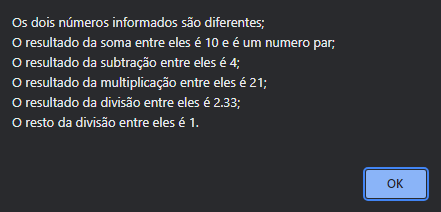

<h1 align="center"> Lógica com JavaScript - 01 </h1>

  <a href="#-tecnologias">Tecnologias</a>&nbsp;&nbsp;&nbsp;|&nbsp;&nbsp;&nbsp;
  <a href="#-projeto">Projeto</a>&nbsp;&nbsp;&nbsp;

 

  

## 🚀 Tecnologias

Esse projeto foi desenvolvido com as seguintes tecnologias:

- JavaScript
- Git e Github

## 💻 Projeto

Nesse desafio foi criado um programa que calcula algumas operações matemáticas entre dois números, informados pelo usuário, além disso, o programa informa se os dois números informados são iguais ou diferentes, e se o resultado da soma entre eles, é par ou ímpar. O desafio foi proposto para treinar tudo o que foi ensinado no stage 04 da trilha explorer da Rocketseat. 

---
